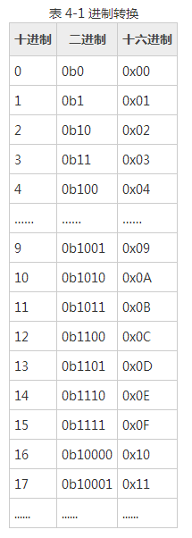

# 4.1 二进制、十进制和十六进制

进制，看似很简单的东西，但很多同学还是不能彻底理解。这里先简单介绍一些注意事项，然后还是从实验中讲解会比较深刻。

1) 十进制就不多说了，逢十进位，一个位有十个值：0~9，我们的生活中到处都是它的身影。二进制就是逢二进位，它的一个位只有两个值：0和1，但它却是实现计算机系统的最基本的理论基础，计算机（包括单片机）芯片是基于成万上亿个的开关管组合而成的，他们每一个都只能有开和关两种状态，再难找出第三个状态了（不要辩解半开半关这个状态，它是不稳定态，是极力避免的），所以他们只能对应于二进制的1和0两个值，而没有2、3、4......，理解二进制对于理解计算机的本质很有帮助。书写二进制数据时需加前缀 0b，每一位的值只能是0或1。十六进制就是把4个二进制位组合为一位来表示，于是它的每一位有 0b0000~0b1111 共16个值，用0~9再加上 A~F（或 a~f）表示，那么它自然就是逢十六进位了，它本质上同二进制是一样的，是二进制的一种缩写形式，也是我们程序编写中常用的形式。书写十六进制数据时需加前缀0x，下表是三种进制之间的对应关系。

2) 对于二进制来说， 8位二进制我们称之为一个字节，二进制的表达范围值是从0b00000000 ~ 0b11111111，而我们在程序中用十六进制表示的时候就是从0x00到0xFF，这里教大家一个二进制转换十进制和十六进制的方法，二进制4位一组，遵循8/4/2/1的规律比如0b1010，那么从最高位开始算，数字大小是 8*1+4*0+2*1+1*0 = 10，那么十进制就是10，十六进制就是0xA。尤其二进制转十六进制的时候，十六进制一位刚好是和二进制的4位相对应的，这些大家不需要强行记忆，多用几次自然就熟练了。

3) `对于进制来说，只是数据的表现形式，而数据的大小不会因为进制表现形式不同而不同`，比如二进制的0b1、十进制的1、十六进制的0x01，他们本质上是数值大小相等的同一个数据。我们在进行 C 语言编程的时候，我们只写十进制和十六进制，那么不带0x的就是十进制，带了0x 符号的就是十六进制。
