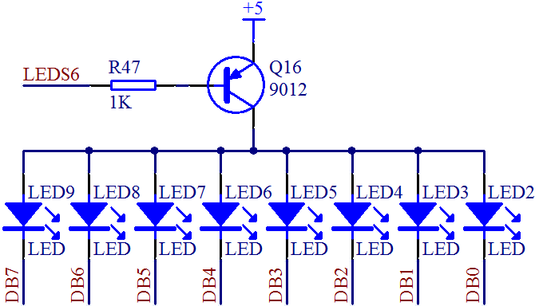

# 4.8 单片机 LED 流水灯程序[详细]

我们前边学了点亮一个 LED 小灯，然后又学了 LED 小灯闪烁，现在我们要进一步学习如何让8个小灯依次一个接一个的点亮，流动起来，也就是常说的流水灯。先来看8个 LED的核心电路图，如图4-12。



图4-12 LED 小灯电路图

通过前面的课程，我们可以了解到控制引脚 P0.0 经过 74HC245 控制了 DB0，P0.1 控制DB1...... P0.7 控制 DB7。我们还学到一个字节是8位，我们如果写一个 P0，就代表了 P0.0 到 P0.7 的全部8个位。比如我们写 P0 = 0xFE；转换成二进制就是 0b11111110，所以点亮 LED小灯的程序，实际上我们可以改成另外一种写法，如下所示。

```
#include <reg52.h>

sbit ADDR0 = P1^0;
sbit ADDR1 = P1^1;
sbit ADDR2 = P1^2;
sbit ADDR3 = P1^3;
sbit ENLED = P1^4;

void main(){
    ENLED = 0;
    ADDR3 = 1;
    ADDR2 = 1;
    ADDR1 = 1;
    ADDR0 = 0;

    P0 = 0xFE;  //向 P0 写入数据来控制 LED 小灯
    while (1);  //程序停止在这里
}
```

通过上边这个程序我们可以看出来，可以通过 P0 来控制所有的8个 LED 小灯的亮和灭。我们下边要进行依次亮和灭，怎么办呢？从这里就可以得到方法了，如果想让单片机流水灯流动起来，依次要赋给 P0 的数值就是：0xFE、0xFD、0xFB、0xF7、0xEF、0xDF、0xBF、0x7F。

在我们的 C 语言当中，有一个移位操作，其中<<代表的是左移，>>代表的是右移。比如a = 0x01<<1;就是 a 的结果等于 0x01 左移一位。大家注意，移位都是指二进制移位，那么移位完了，本来在第0位的1移动到了第一位上，移动完了低位是补0的。所以 a 的值最终是等于0x02。

还要学习另外一个运算符~，这个符号是按位取反的意思，同理按位取反也是针对二进制而言。比如 a = ~(0x01); 0x01的二进制是0b00000001，按位取反后就是0b11111110，那么a 的值就是0xFE 了。

学会了这两个符号后，我们就可以把流水灯的程序写出来，先把程序贴上。

```
#include <reg52.h>

sbit ADDR0 = P1^0;
sbit ADDR1 = P1^1;
sbit ADDR2 = P1^2;
sbit ADDR3 = P1^3;
sbit ENLED = P1^4;

void main(){
   
    unsigned int i = 0;  //定义循环变量 i，用于软件延时
    unsigned char cnt = 0; //定义计数变量 cnt，用于移位控制
   
    ENLED = 0;
    ADDR3 = 1;
    ADDR2 = 1;
    ADDR1 = 1;
    ADDR0 = 0;
    while (1){  //主循环，程序无限循环执行该循环体语句
        P0 = ~(0x01 << cnt);  //P0 等于1左移 cnt 位，控制8个 LED
        for (i=0; i<20000; i++); //软件延时
        cnt++;  //移位计数变量自加1
        if (cnt >= 8){  //移位计数超过7后，再重新从0开始
           cnt = 0;
        }
    }
}
```

程序中 cnt 是 count 的缩写，计数的意思，是非常常用的一个变量名称。当 cnt 等于0的时候，1左移0位还是1，那么写成二进制后就是0b00000001，对这个数字按位取反就是0b11111110，亮的是最右边的小灯。当 cnt 等于7的时候，1左移7位就是0b10000000，按位取反后是0b01111111，亮的是最左边的小灯。中间过程大家可以自己分析一下了。

流水灯结束后，关于小灯的讲解，就暂时告一段落了，后边还有小灯的高级用法，我们到时候再详细讲解。
