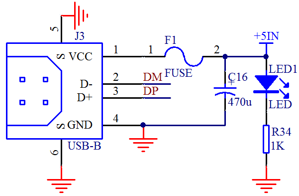
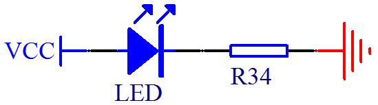
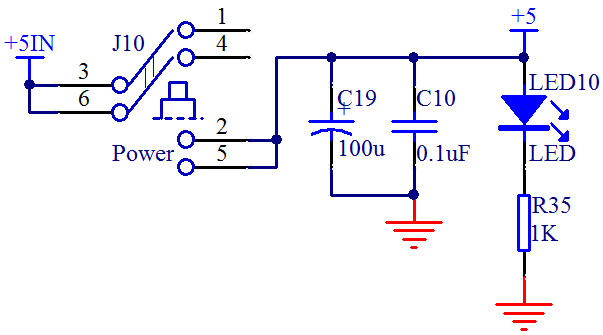
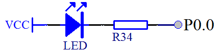

# 单片机上的发光二极管(LED 灯)

LED(light-emitting diode)，即发光二极管，俗称 LED 小灯，它的种类很多，参数也不尽相同，我们板子上用的是普通的贴片发光二极管。这种二极管通常的正向导通电压是1.8 V到2.2 V 之间，工作电流一般在1 mA～20 mA 之间。其中，当电流在1 mA～5 mA 之间变化时，随着通过 LED 的电流越来越大，我们的肉眼会明显感觉到这个小灯越来越亮，而当电流从5 mA～20 mA 之间变化时，我们看到的发光二极管的亮度变化就不是太明显了。当电流超过20 mA 时，LED 就会有烧坏的危险了，电流越大，烧坏的也就越快。所以我们在使用过程中应该特别注意它在电流参数上的设计要求。

那么下面我们来看一下这个发光二极管在开发板上的设计应用。首先来看图2-3。

图2-3 USB 接口电路

图2-3是我们开发板上的 USB 接口电路，通过 USB 线，电脑给我们的开发板供电和下载程序以及实现电脑和开发板之间的通信。从图上可以看出，USB 座共有6个接口，其中2脚和3脚是数据通信引脚，1脚和4脚是电源引脚，1脚是 VCC 正电源，4脚是 GND 即地线。5脚和6脚是外壳，我们直接接到了 GND 上，大家可以观察一下开发板上的这个 USB座的6个引脚。

我们现在主要来看1脚 VCC 和4脚 GND。1脚通过 F1（自恢复保险丝）接到右侧，在正常工作的情况下，保险丝可以直接看成导线，因此左右两边都是 USB 电源+5 V，自恢复保险丝的作用是，当你后级电路哪个地方有发生短路的时候，保险丝会自动切断电路，保护开发板以及电脑的 USB 口，当电路正常后，保险丝会恢复畅通，正常工作。

右侧有2条支路，第一条是在+5 V 和 GND 接了一个 470 uF 的电容，电容是隔离直流的，所以这条支路是没有电流的，电容的作用，我们下节课再介绍，这节课我们主要看第二条支路。我们把第二条支路摘取出来就是如图2-4这个样子。

图2-4 LED 小灯电路（一）

发光二极管是二极管中的一种，因此和普通二极管一样，这个二极管也有阴极和阳极，习惯上也称之为负极和正极。原理图里的 LED 画成这样方便在电路上观察，方向必须接对了才会有电流通过让 LED 小灯发光。刚才提到了我们接入的 VCC 电压是5 V，发光二极管自身压降大概是2 V，那么在右边 R34这个电阻上承受的电压就是3 V。那么现在我们要求电流范围是1~20 mA 的话，就可以根据欧姆定律 R=U/I，把这个电阻的上限和下限值求出来。

U=3 V，当电流是1 mA 的时候，电阻值是3 K；当电流是20 mA 的时候，电阻值是150欧，也就是 R34的取值范围是150~3 K 欧姆。这个电阻值大小的变化，直接可以限制整条通路的电流的大小，因此这个电阻我们通常称之为“限流电阻”。在图2-3中，我们用的电阻是1 K，这条支路电流的大小，我想大家可以轻松计算出来了，而这个发光二极管在这里的作用，是作为电源指示灯的，使用 USB 线将开发板和电脑连起来，这个灯就会亮了。

同理，我们在板子后级开关控制的地方，又添加了一个 LED10发光二极管，作用就是当我们打开开关时，这个二极管才会亮起，如图2-5所示。

图2-5 USB 供电电路

大家注意，这里的开关虽然只有一个，但是是2路的，2路开关并联能更好的确保给后级提供更大的电流。电容 C19 和 C10，都是隔离断开直流的，作用我们下节课介绍，这里大家可以忽略。

那么下面呢，我们把图2-4进行一下变化，把右侧的 GND 去掉，改成一个单片机的 IO口，如图2-6 所示。

图2-6 LED 小灯电路（二）

图2-4由于电源从正极到负极有电压差，并且电路是导通的，所以就会有电流通过，LED小灯因为有了电流通过，所以就会直接发光。我们把右侧的原 GND 处接到单片机 P0.0 引脚上，那么如果我们单片机输出一个低电平，也就是跟 GND 一样的0 V 电压，就可以让 LED小灯和图2-4一样发光了。

因为我们的单片机是可以编程控制的，我们可以让 P0.0 这个引脚输出一个高电平，就是跟 VCC 一样的5 V 电压，那么这个时候，左侧 VCC 电压和右侧的 P0.0 的电压是一致的，那就没有电压差，没有电压差就不会产生电流，没有电流 LED 小灯就不会亮，也就是会处于熄灭状态。下面，我们就用我们的编程软件来实现控制小灯的亮和灭。