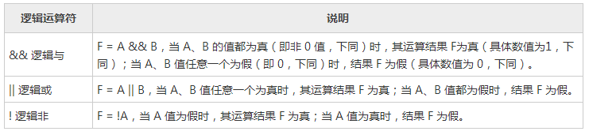
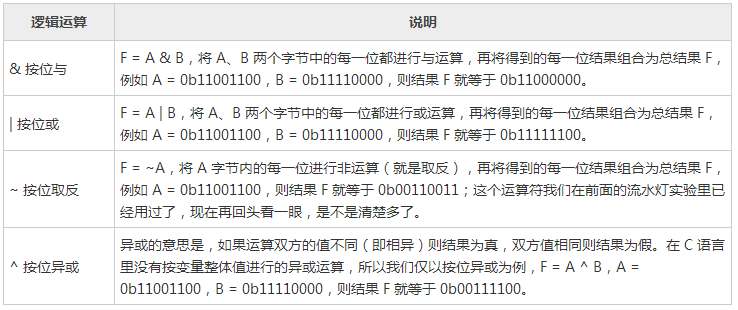
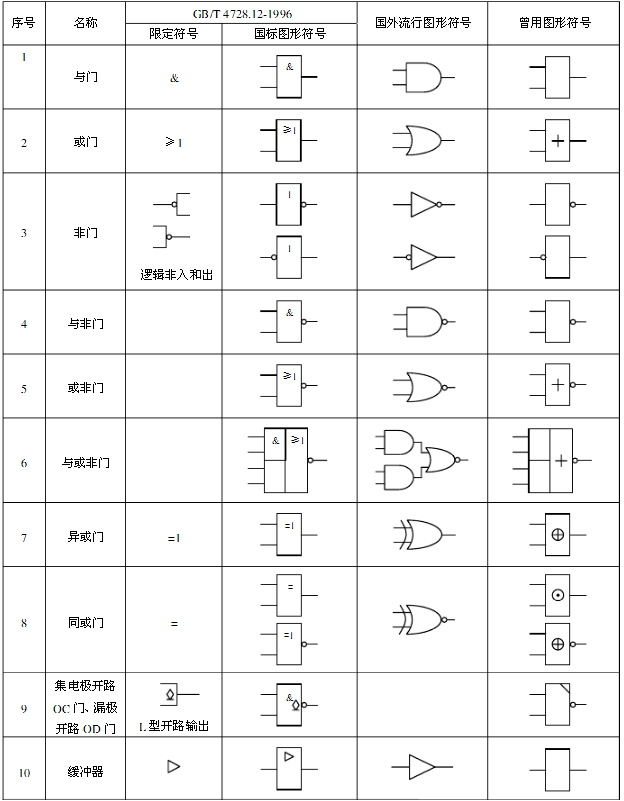

# 5.1 单片机逻辑电路与逻辑运算

在数字电路，我们经常会遇到逻辑电路，而在 C 语言中，我们则经常用到逻辑运算。二者在原理上是相互关联的，我们在这里就先简单介绍一下，随着学习的深入，再慢慢加深理解。

首先，在“逻辑”这个概念范畴内，存在真和假这两个逻辑值，而将其对应到数字电路或 C 语言中，就变成了“非0值”和“0值”这两个值，即逻辑上的“假”就是数字电路或 C 语言中的“0”这个值，而逻辑“真”就是其它一切“非0值”。

然后，我们来具体分析一下几个主要的逻辑运算符。我们假定有2个字节变量：A 和 B，二者进行某种逻辑运算后的结果为 F。

以下逻辑运算符都是按照变量整体值进行运算的，通常就叫做`逻辑运算符`：

以下逻辑运算符都是按照变量内的每一个位来进行运算的，通常就叫做位运算符：

我们今后要看资料或芯片手册的时候，会经常遇到一些电路符号，图5-1所示就是数字电路中的常用符号，知道这些符号有利于我们理解器件的逻辑结构，尤其重点认识图5-1中的国外流行图形符号。在这里我们先简单看一下，如果日后遇到了可以到这里来查阅。

图5-1 逻辑电路符号